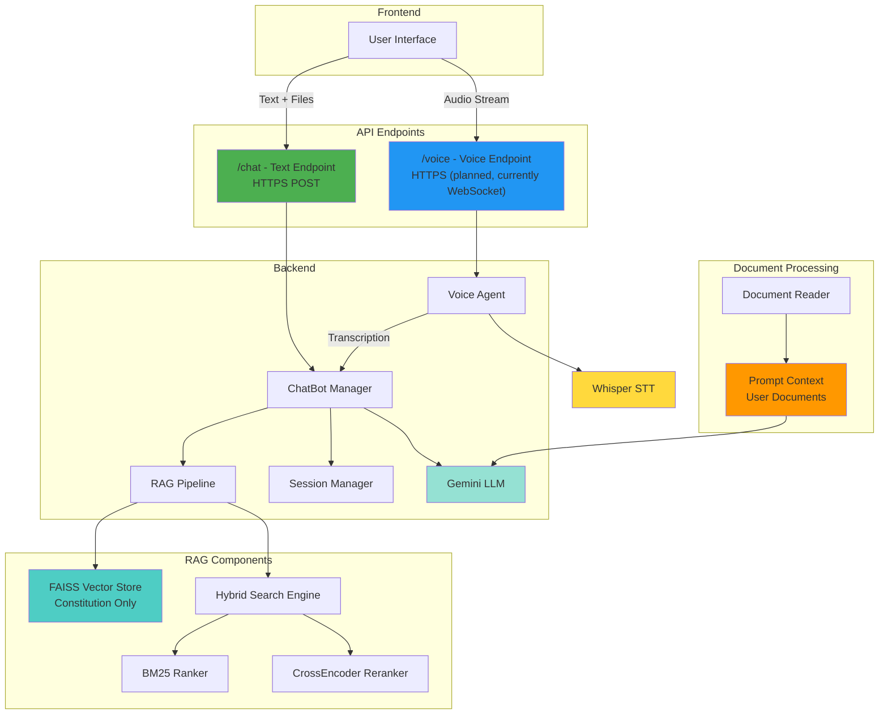

# Lawbot - Constitution & Legal Assistance RAG System
## Complete Project Documentation & Reference Guide

**Version:** 1.1  
**Last Updated:** December 27, 2025  
**Project Type:** Final Year Project (FYP)  
**Status:** 🔧 In Development (Backend refactored, Database integration in progress)

---

## 📋 Table of Contents
1. [Project Overview](#project-overview)
2. [Document Handling Architecture](#document-handling-architecture)
3. [System Architecture](#system-architecture)
4. [Features](#features)
5. [How It Works](#how-it-works)
6. [Technology Stack](#technology-stack)
7. [Code Structure](#code-structure)
8. [API Endpoints](#api-endpoints)
9. [Configuration](#configuration)
10. [RAG Pipeline Details](#rag-pipeline-details)
11. [Voice Feature](#voice-feature)
12. [Session Management](#session-management)
13. [Dependencies](#dependencies)
14. [Known Issues & Limitations](#known-issues--limitations)

---

## 📖 Project Overview

**Lawbot** is an AI-powered legal assistance chatbot that uses **Retrieval-Augmented Generation (RAG)** to provide accurate, context-aware answers to legal questions, specifically focused on constitutional and legal assistance.

### Purpose
- Provide accessible legal information to users
- Answer questions about constitution and legal matters
- Retrieve relevant legal documents and passages
- Generate conversational, accurate legal responses

### Key Capabilities
- **Document Ingestion**: Upload and process PDF, DOCX, TXT legal documents
- **Dual Document Handling**: User documents in prompt context, Constitution in Vector DB
- **Hybrid Search**: 3-stage retrieval (Vector + BM25 + Cross-encoder reranking) for Constitution
- **Conversational AI**: LLM-powered responses with conversation history
- **Voice Input**: Speech-to-text for hands-free interaction
- **Streaming Responses**: Real-time token-by-token output
- **Multi-user Support**: Session-based isolation per user

---

## 📄 Document Handling Architecture

> [!IMPORTANT]
> The chatbot uses a **dual document handling strategy** to optimize for both performance and accuracy.

### 1. User-Uploaded Documents (Prompt-Based)

**User documents are NOT added to the vector database.** Instead, they are:
- Extracted and processed at upload time
- Added directly to the LLM prompt as context
- This preserves computation and avoids unnecessary vector embedding

**Why this approach?**
- **Faster processing**: No embedding/indexing overhead
- **Fresh context**: Documents are immediately available
- **Session-specific**: Each user's documents are isolated in their prompt
- **Cost-effective**: Reduces vector DB storage and computation

```
User Upload Flow:
  User uploads document (PDF/DOCX/TXT)
    ↓
  DocumentReader extracts text
    ↓
  Text added to prompt context
    ↓
  LLM receives: Question + User Doc Context + Constitution Context
```

### 2. Constitution Documents (Vector DB)

**Vector database is reserved for system-level constitution documents** which are:
- Pre-loaded at system startup
- Indexed using FAISS with hybrid search
- Shared across all user sessions
- Used for constitutional queries via RAG pipeline

**Why this approach?**
- **Persistent knowledge base**: Constitution doesn't change frequently
- **Efficient retrieval**: Hybrid search for accurate legal passages
- **Shared resource**: All users benefit from the same indexed content

```
Constitution Query Flow:
  User asks constitutional question
    ↓
  Hybrid Search (Vector + BM25 + Rerank)
    ↓
  Top relevant passages retrieved
    ↓
  Context injected into LLM prompt
```

### Summary Table

| Document Type | Storage | Processing | Use Case |
|---------------|---------|------------|----------|
| User Uploads | Prompt Context | On-demand extraction | User-specific legal docs |
| Constitution | FAISS Vector DB | Pre-indexed | Constitutional queries |

---

## 🏗️ System Architecture

### High-Level Flow



### API Endpoints

| Endpoint | Protocol | Purpose | Status |
|----------|----------|---------|--------|
| `/chat` | HTTPS POST | Text chat with optional file uploads | ✅ Active |
| `/voice` | HTTPS (planned) | Voice input with audio streaming | 🔧 Currently WebSocket |

### Component Breakdown

1. **FastAPI Server** ([main.py](file:///d:/ML/Lawbot/backend/main.py))
   - Two separate endpoints for text and voice
   - Manages chatbot instances per session
   - CORS configuration for frontend integration

2. **ChatBot** ([ChatBot.py](file:///d:/ML/Lawbot/backend/core/agents/ChatBot.py))
   - Central orchestrator for chat functionality
   - Integrates RAG pipeline with LLM
   - Manages conversation flow and history

3. **RAG Pipeline** ([Rag.py](file:///d:/ML/Lawbot/backend/core/services/Rag.py))
   - Constitution document retrieval (Vector DB)
   - Hybrid search implementation
   - User documents handled separately via prompt

4. **Document Reader** ([DocReader.py](file:///d:/ML/Lawbot/backend/core/services/DocReader.py))
   - Multi-format support (PDF, DOCX, TXT)
   - Extracts text for prompt context
   - Encoding fallbacks

5. **Voice Agent** ([VoiceAgent.py](file:///d:/ML/Lawbot/backend/core/agents/VoiceAgent.py))
   - Audio processing and transcription
   - Whisper-based speech-to-text
   - Will migrate to HTTPS endpoint

---

## ✨ Features

### 1. **Document Upload & Processing**
- **Supported Formats**: PDF, DOCX, TXT
- **Processing**: Automatic text extraction
- **User Documents**: Added directly to prompt context (NOT vector DB)
- **Constitution**: Pre-indexed in FAISS for RAG queries

**How it works:**
```python
# User uploads file via /chat endpoint
POST /chat
  - chat_id: "user123"
  - message: "What does this contract say about liability?"
  - files: [contract.pdf]

# Backend processes:
1. DocumentReader extracts text from PDF
2. Text added to prompt as context (NOT to vector DB)
3. For constitutional queries, RAG retrieves from pre-indexed Constitution
4. LLM receives: User question + Uploaded doc context + Constitution context
5. Response streamed to user
```

### 2. **Hybrid RAG Search** (3-Stage Retrieval)

**Stage 1: Dense Vector Search**
- Uses HuggingFace embeddings (`all-MiniLM-L6-v2`)
- FAISS similarity search
- Retrieves initial 20 candidates

**Stage 2: BM25 Sparse Retrieval**
- Keyword-based ranking on candidates
- TF-IDF scoring
- Filters results by relevance

**Stage 3: Cross-Encoder Reranking**
- Fine-grained semantic matching
- Uses `ms-marco-MiniLM-L-6-v2`
- Returns top 3 most relevant chunks

**Why Hybrid?**
- **Dense vectors**: Semantic understanding
- **BM25**: Exact legal term matching
- **Reranking**: Precision for critical legal context

### 3. **Conversational AI with Memory**

- **LLM**: Groq API (`openai/gpt-oss-20b`)
- **Memory**: Sliding window (keeps last 3-4 messages)
- **Context**: RAG-retrieved documents injected
- **Tools**: Math operations, final answer tool

**Conversation Flow:**
```
User: "What is Article 10?"
  ↓
RAG retrieves relevant chunks about Article 10
  ↓
LLM receives:
  - User question
  - Retrieved context
  - Conversation history (last 3-4 exchanges)
  ↓
LLM generates response with context
  ↓
Response streamed token-by-token to user
```

### 4. **Voice Input** 🎤

**Endpoint**: `WS /voice?chat_id=<id>`

**How it works:**
1. User sends audio bytes via WebSocket
2. Backend accumulates chunks in BytesIO buffer
3. When 'text' signal received, processing starts
4. VoiceAgent transcribes audio using Whisper (base model)
5. Transcription sent to ChatBot as text query
6. Response streamed back via WebSocket

**Audio Processing:**
- Resamples to 16kHz mono
- Supports various audio formats (WAV, etc.)
- Fallback to temp file if BytesIO fails
- Returns empty string on complete failure (graceful degradation)

**Example Usage:**
```javascript
const ws = new WebSocket('ws://localhost:8000/voice?chat_id=user123');
ws.send(audioBlob);  // Send audio chunks
ws.send('end');      // Signal transcription
ws.onmessage = (e) => console.log(e.data); // Receive tokens
```

### 5. **Streaming Responses**

- Real-time token generation
- Low latency user experience
- Character filtering for duplicate symbols
- HTTP streaming via `StreamingResponse`

**Filtering Logic:**
```python
buffer = ['\"', '-', '*', '—']
# Allows first occurrence, skips second (toggle mechanism)
# Prevents duplicate special characters in output
```

### 6. **Multi-User Session Management**

- **Isolation**: Each chat_id gets separate ChatBot instance
- **Caching**: Instances cached in memory for reuse
- **History**: Per-session conversation history
- **Persistence**: FAISS index shared across sessions

**Session Flow:**
```python
chatbot_cache = {}

def get_or_create_chatbot(chat_id):
    if chat_id not in chatbot_cache:
        chatbot_cache[chat_id] = ChatBot()  # New instance
    return chatbot_cache[chat_id]
```

### 7. **Agent Framework with Tools**

Uses LangChain's agent executor with tool calling:

**Available Tools:**
- `add_numbers(a, b)` - Addition
- `multiply_numbers(a, b)` - Multiplication
- `divide_numbers(a, b)` - Division
- `subtract_numbers(a, b)` - Subtraction
- `final_answer(answer)` - Return response

**Agent Behavior:**
- Decides when to use tools
- Can chain multiple tool calls
- Always calls `final_answer` at the end
- Uses few-shot examples for guidance

---

## ⚙️ How It Works

### Complete Request Flow (Text Chat)

```
1. User Request
   ↓
   POST /chat
   - chat_id: "session123"
   - message: "Explain Article 15"
   - files: [optional]

2. Backend Processing
   ↓
   get_or_create_chatbot(chat_id)
   ↓
   If files provided:
     - DocumentReader.read(file) → text chunks
     - RAGPipeline.ingest(chunks) → FAISS store
   ↓
   ChatBot.ask_stream(message)
   ↓
   RAGPipeline._retrieve_context()
     - Vector search (k=20)
     - BM25 ranking
     - CrossEncoder reranking (top 3)
   ↓
   Context + History + Prompt → LLM
   ↓
   Agent decides: use tools or answer directly
   ↓
   LLM generates tokens

3. Response Streaming
   ↓
   async for token in ask_stream():
     - Filter special characters
     - yield token
   ↓
   StreamingResponse to user
```

### RAG Pipeline Internals

**Ingestion:**
```python
def ingest(raw_texts: list[str]):
    # 1. Create Document objects
    docs = [Document(page_content=t) for t in raw_texts]
    
    # 2. Split into chunks
    chunks = text_splitter.split_documents(docs)
    # chunk_size=500, chunk_overlap=50
    # separators=["\n\n", "\n", ".", " ", ""]
    
    # 3. Embed and store
    if vectorstore:
        vectorstore.add_documents(chunks)
    else:
        vectorstore = FAISS.from_documents(chunks, embedding_model)
```

**Query:**
```python
def query(question: str, k=3, initial_k=20):
    # Stage 1: Vector similarity
    dense_results = vectorstore.similarity_search(question, k=20)
    
    # Stage 2: BM25
    texts = [doc.page_content for doc in dense_results]
    bm25 = BM25Okapi([text.split() for text in texts])
    bm25_scores = bm25.get_scores(question.split())
    sorted_docs = sort_by_bm25_score(dense_results, bm25_scores)
    
    # Stage 3: Rerank
    pairs = [[question, doc.page_content] for doc in sorted_docs]
    rerank_scores = reranker.predict(pairs)
    final_docs = sort_by_rerank_score(sorted_docs, rerank_scores)[:k]
    
    return final_docs
```

### Prompt Engineering

**System Prompt:**
```
You are a helpful AI assistant.
- Only use tools if directly relevant
- Never repeat tool calls
- Call final_answer exactly once at the end
- Use provided context when possible
```

**Few-Shot Examples:**
- Math operations → tool usage
- General questions → direct answering
- Format demonstrations

**User Prompt:**
```
query starts {question} query ends
Use the following for context {context}
```

**History Injection:**
```python
MessagesPlaceholder(variable_name="chat_history")
# Inserts last k messages from session
```

---

## 🛠️ Technology Stack

### Backend Framework
- **FastAPI** 0.116.1+ - Async web framework
- **Uvicorn** 0.35.0+ - ASGI server
- **Python** 3.12+

### LLM & Embeddings
- **Google Gemini API** - LLM provider (`gemini-1.5-flash`)
- **HuggingFace Embeddings** - `sentence-transformers/all-MiniLM-L6-v2`
- **LangChain** 0.3.27+ - LLM orchestration
- **LangChain-Google-GenAI** 2.0.8+ - Gemini integration

### RAG Components
- **FAISS-CPU** 1.12.0+ - Vector similarity search
- **rank-bm25** 0.2.2+ - BM25 sparse retrieval
- **sentence-transformers** 5.1.0+ - CrossEncoder reranking

### Document Processing
- **PyPDF2** 3.0.1+ - PDF reading
- **python-docx** 1.2.0+ - DOCX reading
- **RecursiveCharacterTextSplitter** - Text chunking

### Voice Processing
- **openai-whisper** 20250625+ - Speech-to-text
- **librosa** 0.11.0+ - Audio processing
- **soundfile** 0.13.1+ - Audio I/O

### Utilities
- **python-dotenv** 1.1.1+ - Environment config
- **websockets** 15.0.1+ - WebSocket support

---

## 📁 Code Structure

```
d:/ML/Lawbot/
├── backend/                      # Backend application
│   ├── main.py                  # FastAPI app, endpoints, CORS
│   ├── manage.py                # Django-style management (for database)
│   ├── core/                    # Core application logic
│   │   ├── agents/              # AI Agents
│   │   │   ├── ChatBot.py       # ChatBot orchestrator
│   │   │   └── VoiceAgent.py    # Whisper voice transcription
│   │   ├── services/            # Business logic services
│   │   │   ├── Rag.py           # RAG pipeline with hybrid search
│   │   │   ├── DocReader.py     # Multi-format document reader
│   │   │   ├── Prompts.py       # System/user prompts, few-shot
│   │   │   └── Tools.py         # LangChain tools (math, final_answer)
│   │   ├── utilities/           # Helper utilities
│   │   │   ├── SessionManager.py# Session memory management
│   │   │   ├── History.py       # Buffer window message history
│   │   │   └── Streaming.py     # Async callback for streaming
│   │   ├── configs/             # Configuration files
│   │   └── tests/               # Unit tests
│   ├── database/                # Django database app (NEW)
│   │   ├── models.py            # Database models
│   │   ├── apps.py              # App configuration
│   │   ├── migrations/          # Database migrations
│   │   └── tests.py             # Database tests
│   ├── configs/                 # Backend configs
│   └── faiss_index/             # FAISS vector store (Constitution)
│       ├── index.faiss
│       └── index.pkl
├── frontend/                     # Frontend application
├── docs/                         # Documentation
│   ├── project_overview.md      # Comprehensive overview
│   ├── flowchart.jpg            # System flowchart
│   ├── softarch.drawio.png      # Software architecture
│   └── *.pdf/*.docx             # FYP reports and proposals
├── tests/                        # Integration tests
├── .env                         # Environment variables (not in git)
├── .env.example                 # Environment template
├── .gitignore                   # Git ignore rules
├── README.md                    # Quick start guide
├── pyproject.toml               # Dependencies (uv format)
└── uv.lock                      # Lock file
```

### File Descriptions

**[main.py](file:///d:/ML/Lawbot/backend/main.py)** (126 lines)
- FastAPI application setup
- CORS middleware configuration
- `/chat` endpoint (HTTP POST with streaming)
- `/voice` endpoint (WebSocket)
- Chatbot caching and management
- File processing helper

**[ChatBot.py](file:///d:/ML/Lawbot/backend/ChatBot.py)** (129 lines)
- ChatBot class with LLM integration
- RAG pipeline integration
- Agent executor setup
- `read()` - Document ingestion
- `ask()` - Synchronous query
- `ask_stream()` - Async streaming query
- Pipeline configuration with history

**[Rag.py](file:///d:/ML/Lawbot/backend/Rag.py)** (143 lines)
- RAGPipeline class
- Document ingestion and chunking
- FAISS vector store management
- Hybrid search (Vector + BM25 + Rerank)
- `read()` - Ingest from file path
- `ingest()` - Process text chunks
- `query()` - Hybrid search
- `_retrieve_context()` - Pipeline integration
- `save()` / `load()` - Persistence

**[DocReader.py](file:///d:/ML/Lawbot/backend/DocReader.py)** (264 lines)
- DocumentReader class
- Multi-format support (PDF, DOCX, TXT)
- File object and path handling
- Encoding fallbacks
- Error handling

**[Prompts.py](file:///d:/ML/Lawbot/backend/Prompts.py)** (80 lines)
- ChatBotPrompts class
- System prompt
- Few-shot examples
- User prompt template
- History introduction
- Prompt builder

**[Tools.py](file:///d:/ML/Lawbot/backend/Tools.py)** (55 lines)
- MathTools class
- Math operations (add, multiply, divide, subtract)
- `final_answer` tool
- Tool collection method

**[SessionManager.py](file:///d:/ML/Lawbot/backend/SessionManager.py)** (19 lines)
- SessionMemoryManager class
- Session-based memory storage
- Session creation and cleanup

**[History.py](file:///d:/ML/Lawbot/backend/History.py)** (26 lines)
- BufferWindowMessageHistory class
- Sliding window memory (keeps last k messages)
- Add/clear message methods

**[Streaming.py](file:///d:/ML/Lawbot/backend/Streaming.py)** (41 lines)
- QueueCallbackHandler class
- Async token streaming
- LLM callback handling

**[VoiceAgent.py](file:///d:/ML/Lawbot/backend/VoiceAgent.py)** (97 lines)
- VoiceAgent class
- Audio decoding and resampling
- Whisper transcription
- Fallback mechanisms

---

## 🌐 API Endpoints

### 1. POST /chat

**Purpose**: Chat with streaming responses

**Request:**
```http
POST /chat HTTP/1.1
Content-Type: multipart/form-data

chat_id: "user123"
message: "What is Article 10?"
files: [optional PDF/DOCX/TXT files]
```

**Response:**
```http
HTTP/1.1 200 OK
Content-Type: text/plain
Cache-Control: no-cache
Connection: keep-alive

Article 10 of the Constitution states...
```

**Features:**
- Streaming response (token-by-token)
- Optional file upload
- Session-based chatbot instance
- Context from uploaded documents

**Error Handling:**
```python
try:
    # Process request
except Exception as e:
    return StreamingResponse(
        error_response(),
        media_type="text/plain"
    )
```

### 2. WebSocket /voice

**Purpose**: Voice input with real-time transcription and response

**Connection:**
```javascript
const ws = new WebSocket('ws://localhost:8000/voice?chat_id=user123');
```

**Flow:**
```
Client → Server
  - Send audio bytes chunks
  - Send 'end' text signal

Server → Client
  - Transcribe audio
  - Process query
  - Stream response tokens
```

**Implementation:**
```python
@app.websocket("/voice")
async def voice_endpoint(websocket, chat_id):
    await websocket.accept()
    buffer = io.BytesIO()
    
    # Accumulate audio
    while True:
        chunk = await websocket.receive()
        if 'bytes' in chunk:
            buffer.write(chunk['bytes'])
        if 'text' in chunk:
            break
    
    # Transcribe
    audio_bytes = buffer.getvalue()
    transcription = VoiceAgent().transcribe_bytes(audio_bytes)
    
    # Stream response
    async for token in generate_response(chatbot, chat_id, transcription):
        await websocket.send_text(token)
```

---

## 🔧 Configuration

### Environment Variables

**File**: `.env` (not in git, use `.env.example` template)

```bash
GEMINI_API_KEY=your_gemini_api_key_here
```

**Get API Key**: https://aistudio.google.com/app/apikey

### CORS Configuration

**File**: [main.py](file:///d:/ML/Lawbot/backend/main.py#L11-L21)

```python
origins = [
    "https://rag-agent-iota.vercel.app",  # Production frontend
    "http://localhost:3000",               # Local development
]

app.add_middleware(
    CORSMiddleware,
    allow_origins=origins,
    allow_credentials=True,
    allow_methods=["*"],
    allow_headers=["*"],
)
```

### RAG Configuration

**Embedding Model**: `sentence-transformers/all-MiniLM-L6-v2`
**Chunk Size**: 500 characters
**Chunk Overlap**: 50 characters
**Initial Retrieval**: 20 candidates
**Final Results**: 3 documents
**Reranker**: `cross-encoder/ms-marco-MiniLM-L-6-v2`

**Customization**:
```python
rag = RAGPipeline(
    embedding_model_name="sentence-transformers/all-MiniLM-L6-v2",
    chunk_size=500,
    chunk_overlap=50
)
```

### LLM Configuration

**Model**: `gemini-1.5-flash` (Google Gemini Free Tier)
**Temperature**: 0.7
**Streaming**: Enabled
**Callbacks**: QueueCallbackHandler for streaming

### Voice Configuration

**Whisper Model**: `base` (options: tiny/small/medium/large)
**Target Sample Rate**: 16kHz
**Language**: English (configurable)
**Device**: Auto-detect (CPU/GPU)

---

## 🔍 RAG Pipeline Details

### Document Processing

**Text Splitting Strategy:**
```python
RecursiveCharacterTextSplitter(
    chunk_size=500,
    chunk_overlap=50,
    separators=["\n\n", "\n", ".", " ", ""]
)
```

**Why these settings?**
- 500 chars: Balances context and specificity
- 50 overlap: Preserves continuity across chunks
- Hierarchical separators: Respects document structure

### Vector Store (FAISS)

**Index Type**: FAISS (Facebook AI Similarity Search)
**Persistence**: Saved to `backend/faiss_index/`
**Files**:
- `index.faiss` - Vector index
- `index.pkl` - Metadata

**Operations:**
```python
# Save
vectorstore.save_local("faiss_index")

# Load
vectorstore = FAISS.load_local(
    "faiss_index",
    embedding_model,
    allow_dangerous_deserialization=True
)

# Add documents
vectorstore.add_documents(chunks)

# Search
results = vectorstore.similarity_search(query, k=20)
```

### Hybrid Search Breakdown

**Why 3 Stages?**

1. **Vector Search**:
   - Pros: Semantic understanding, handles synonyms
   - Cons: May miss exact legal terms
   
2. **BM25**:
   - Pros: Exact keyword matching, good for legal terminology
   - Cons: No semantic understanding
   
3. **CrossEncoder**:
   - Pros: Most accurate, computes query-document relevance
   - Cons: Computationally expensive (only on top candidates)

**Performance:**
- Initial: 20 candidates (fast vector search)
- BM25: Filters 20 → ranked list
- Rerank: Top 3 (expensive but accurate)

---

## 🎤 Voice Feature

### Architecture

```
Audio Input
  ↓
WebSocket Connection
  ↓
Byte Accumulation (BytesIO)
  ↓
Whisper Transcription
  ↓
Text Query to ChatBot
  ↓
Streaming Response
  ↓
WebSocket Output
```

### Audio Processing Pipeline

**Step 1: Decode**
```python
def _decode_audio_bytes(audio_bytes, target_sr=16000):
    # Try BytesIO first
    buf = BytesIO(audio_bytes)
    try:
        data, sr = sf.read(buf, dtype="float32")
    except:
        # Fallback to temp file
        with tempfile.NamedTemporaryFile(suffix=".wav") as tmp:
            tmp.write(audio_bytes)
            data, sr = sf.read(tmp.name, dtype="float32")
    
    # Convert to mono
    if data.ndim > 1:
        data = np.mean(data, axis=1)
    
    # Resample to 16kHz
    if sr != target_sr:
        data = librosa.resample(data, orig_sr=sr, target_sr=target_sr)
    
    return data.astype(np.float32).flatten()
```

**Step 2: Transcribe**
```python
def transcribe_bytes(audio_bytes, language="en"):
    audio = _decode_audio_bytes(audio_bytes)
    
    # Check for silence
    if audio.size == 0 or np.allclose(audio, 0.0):
        return ""
    
    # Whisper transcription
    result = whisper_model.transcribe(audio, language=language)
    return result.get("text", "").strip()
```

### Error Handling

**Fallback Chain:**
1. BytesIO → soundfile
2. Temp file → soundfile
3. Temp file → Whisper direct
4. Return empty string (graceful degradation)

**Why this approach?**
- Different audio formats may fail at different stages
- Temp file is more compatible but slower
- Empty string prevents None errors downstream

### Supported Audio Formats

- WAV (recommended)
- MP3
- OGG
- FLAC
- Any format supported by soundfile/librosa

---

## 🧠 Session Management

### Session Lifecycle

```python
# Session Creation
chatbot_cache = {}

def get_or_create_chatbot(chat_id):
    if chat_id not in chatbot_cache:
        print(f"[{chat_id}] Creating new ChatBot instance")
        chatbot_cache[chat_id] = ChatBot()
    else:
        print(f"[{chat_id}] Using existing ChatBot instance")
    return chatbot_cache[chat_id]
```

### Memory Management

**BufferWindowMessageHistory:**
```python
class BufferWindowMessageHistory:
    def __init__(self, k=4):
        self.messages = []
        self.k = k
    
    def add_messages(self, messages):
        self.messages.extend(messages)
        self.messages = self.messages[-self.k:]  # Keep last k
```

**Session Memory:**
```python
class SessionMemoryManager:
    session_memory_map = {}
    
    @staticmethod
    def get_session(session_id, k=3):
        if session_id not in session_memory_map:
            session_memory_map[session_id] = BufferWindowMessageHistory(k=k)
        return session_memory_map[session_id]
```

### Isolation

- Each `chat_id` gets separate ChatBot instance
- Separate conversation history
- Separate RAG context (but shared FAISS index)
- No cross-session data leakage

---

## 📦 Dependencies

### Installation

```bash
# Install uv package manager
pip install uv

# Install all dependencies
uv sync
```

### Core Dependencies

```toml
[project]
requires-python = ">=3.12"
dependencies = [
    "faiss-cpu>=1.12.0",
    "fastapi>=0.116.1",
    "langchain>=0.3.27",
    "langchain-community>=0.3.27",
    "langchain-google-genai>=2.0.8",
    "langchain-huggingface>=0.3.1",
    "langchain-openai>=0.3.30",
    "librosa>=0.11.0",
    "openai-whisper>=20250625",
    "pypdf2>=3.0.1",
    "python-docx>=1.2.0",
    "python-dotenv>=1.1.1",
    "python-multipart>=0.0.20",
    "rank-bm25>=0.2.2",
    "sentence-transformers>=5.1.0",
    "soundfile>=0.13.1",
    "uvicorn[standard]>=0.35.0",
    "websockets>=15.0.1",
]
```

---

## ⚠️ Known Issues & Limitations

### Current Limitations

1. **No Chatbot Cache Cleanup**
   - Memory grows with unique chat_ids
   - **Recommendation**: Implement TTL or LRU cache

2. **FAISS Index Sharing**
   - All sessions share same vector store
   - Per-user document isolation not implemented
   - **Future**: User-specific indexes or metadata filtering

3. **No Authentication**
   - chat_id is only identifier
   - No user authentication/authorization
   - **Future**: JWT or session tokens

4. **Character Filtering**
   - Toggle-based filtering may need tuning
   - Hardcoded characters: `['\"', '-', '*', '—']`

5. **Voice Model Size**
   - Whisper 'base' model balances speed/accuracy
   - Larger models (medium/large) more accurate but slower

### Fixed Issues

✅ **Variable name mismatch in voice endpoint** - Fixed  
✅ **Syntax errors in prompts** - Fixed  
✅ **Missing FAISS error handling** - Fixed  
✅ **Return type annotations** - Fixed  
✅ **CrossEncoder lazy loading** - Fixed (moved to `__init__`)  
✅ **VoiceAgent error handling** - Fixed  
✅ **Non-ASCII characters** - Fixed  

---

## 🚀 Quick Start

### 1. Setup

```bash
# Clone repository
git clone https://github.com/Hashir-Ali-Shah/legal_assistant.git
cd legal_assistant

# Install dependencies
pip install uv
uv sync

# Configure environment
cp .env.example .env
# Edit .env and add GROQ_API_KEY
```

### 2. Run Server

```bash
cd backend
uvicorn main:app --reload --host 0.0.0.0 --port 8000
```

### 3. Test Endpoints

**Chat (curl):**
```bash
curl -X POST http://localhost:8000/chat \
  -F "chat_id=test123" \
  -F "message=What is Article 10?" \
  -F "files=@constitution.pdf"
```

**Voice (JavaScript):**
```javascript
const ws = new WebSocket('ws://localhost:8000/voice?chat_id=test123');
ws.onopen = () => {
    // Send audio blob
    ws.send(audioBlob);
    ws.send('end');
};
ws.onmessage = (e) => console.log(e.data);
```

---

## 📚 Additional Resources

- **Repository**: https://github.com/Hashir-Ali-Shah/legal_assistant
- **Gemini API**: https://aistudio.google.com/app/apikey
- **LangChain Docs**: https://python.langchain.com/
- **FAISS**: https://github.com/facebookresearch/faiss
- **Whisper**: https://github.com/openai/whisper

---

## 📝 Future Enhancements

### Planned Features
1. User authentication and authorization
2. Per-user document isolation
3. Citation extraction and display
4. Advanced query classification
5. Evaluation metrics and logging
6. Frontend UI integration
7. Deployment to cloud (AWS/GCP/Azure)
8. Legal-specific fine-tuning
9. Multi-language support
10. Document summarization

### Technical Improvements
1. LRU cache for chatbot instances
2. Database for persistent sessions
3. Prometheus metrics
4. Structured logging
5. Rate limiting
6. Input validation
7. Better error messages
8. Health check endpoint
9. Admin dashboard
10. A/B testing framework

---

## 📊 Current Project Status

### Completed
- ✅ Core chatbot functionality
- ✅ RAG pipeline with hybrid search
- ✅ Voice input (Whisper)
- ✅ Streaming responses
- ✅ Backend refactoring (modular structure)
- ✅ Frontend integration

### In Progress
- 🔧 Database integration (Django models)
- 🔧 User document handling (prompt-based approach)
- 🔧 Constitution pre-indexing for Vector DB

### Planned
- ⏳ User authentication
- ⏳ Chat history persistence
- ⏳ Document management UI

---

**Last Updated**: December 27, 2025  
**Status**: 🔧 In Development (Backend refactored, Database integration in progress)  
**Maintainer**: Hashir Ali Shah  
**License**: Final Year Project
